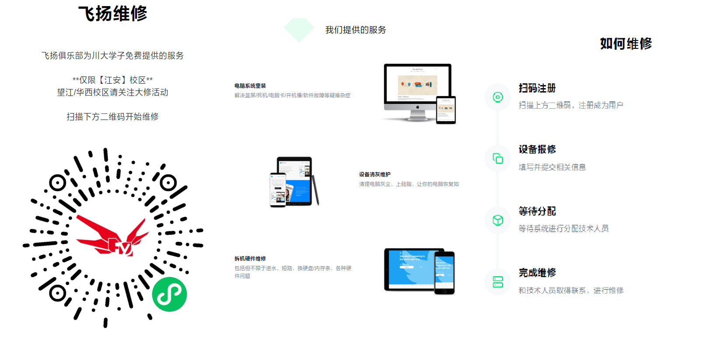
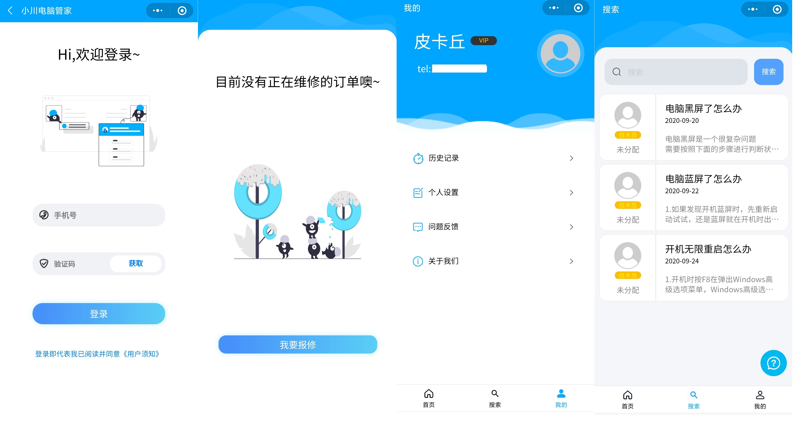
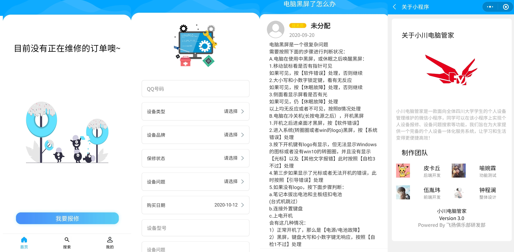
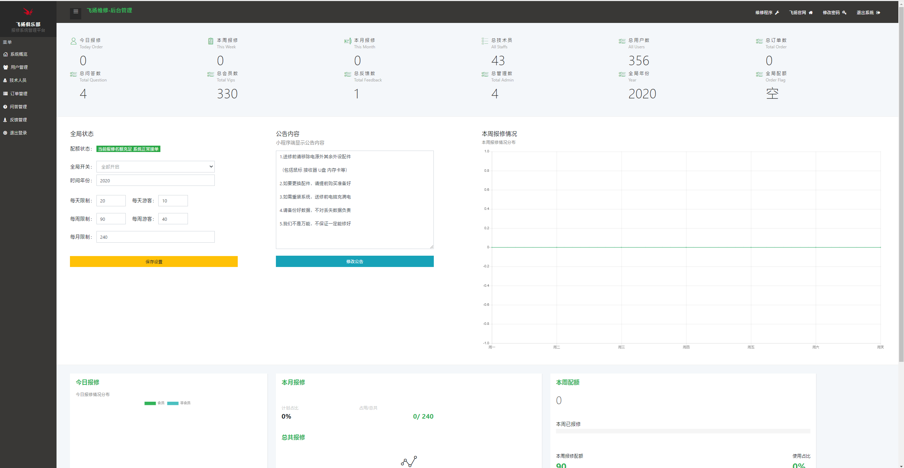
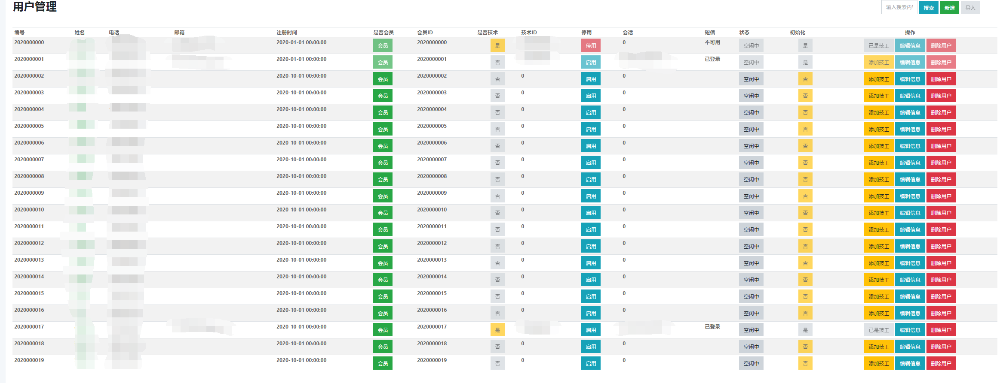
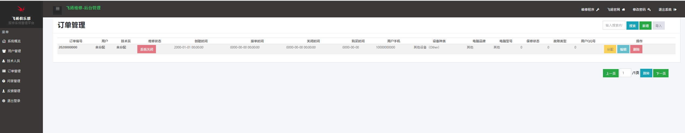
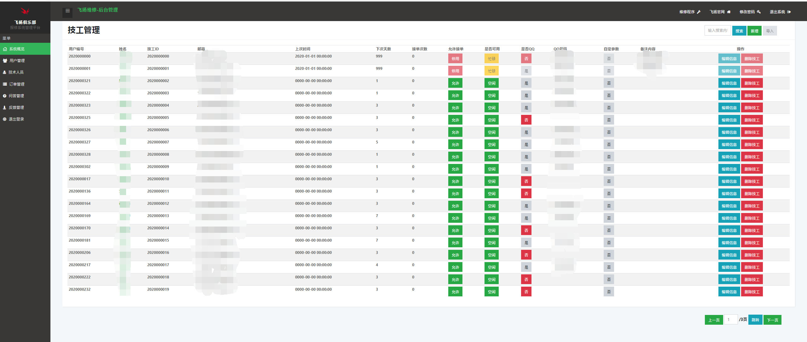
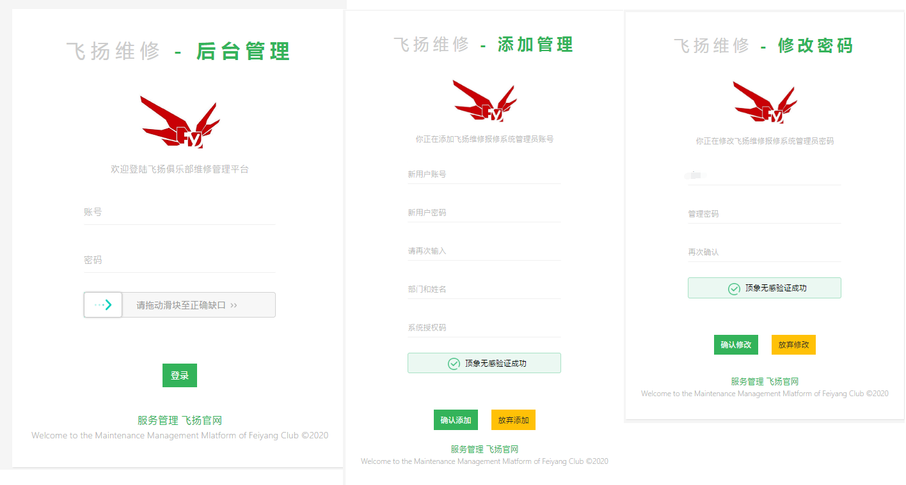
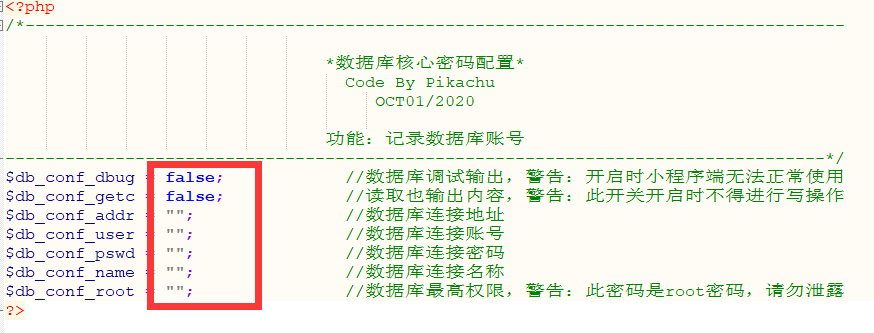
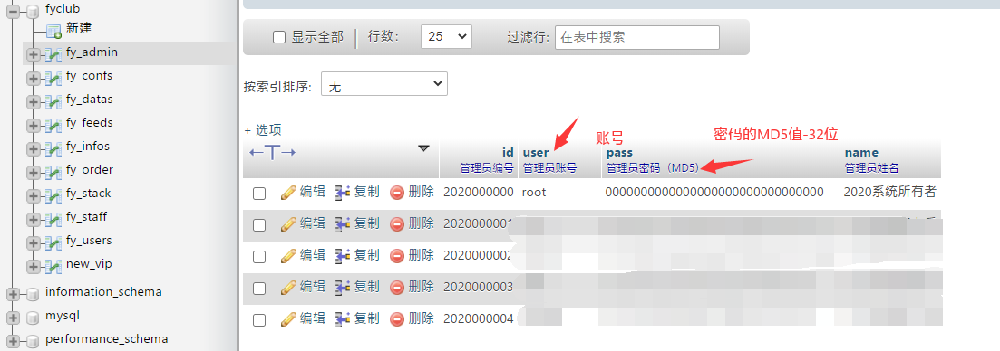

# 飞扬俱乐部-维修系统

## [fix.fyscu.com](https://fix.fyscu.com)

### 网站介绍

#### 本项目是飞扬俱乐部的维修小程序的前后端和管理平台

```
四川大学飞扬俱乐部，创建于2003年9月，是一个集技术交流、电脑维修、软件研发、网站小程序等建设维护于一体的专业公益IT社团

飞扬秉承“创新实践，服务川大”理念，旨在通过专业技术应用及研发服务大众向川大师生提供免费的电脑维修维护及其他科技服务。
```


### 网站图片

### 欢迎报修网站



### 微信小程序





### 系统管理平台












## 安装条件

- ### PHP >= 7.0

- ### MYSQL >= 5.6

- ### LINUX 系统 （推荐CENTOS > 7.0)

- ### 微信公众平台

- ### SSL证书和域名

## 安装方法

1. ### 部署后端平台，填写api/config下面的php文件内的信息

   

2. ### 修改小程序内部的API路径，推荐全局查找替换

3. ### 部署小程序，发布体验版或者审核上线

4. ### 将SQL文件导入到数据库，去fy_admin添加管理员

   

5. ### 登录admin/后台添加技术员信息

   ```
   你的网站/admin/login.php
   ```

   

6. ### 添加定时任务

```
#每分钟执行的任务
php /www/wwwroot/网站文件夹/api/ontime/exc_halfamin.php >>/www/wwwroot/fix.fyscu.com/api/ontime/runlog.log

#每天应当执行一次
php /www/wwwroot/网站文件夹/api/ontime/exc_onperday.php >>/www/wwwroot/fix.fyscu.com/api/ontime/runlog.log

#每周必须执行一次
php /www/wwwroot/网站文件夹/api/ontime/exc_onweekly.php >>/www/wwwroot/fix.fyscu.com/api/ontime/runlog.log

#每月需要执行命令
php /www/wwwroot/网站文件夹/api/ontime/exc_permonth.php >>/www/wwwroot/fix.fyscu.com/api/ontime/runlog.log

#清理日志，建议每周执行一次
data=$(date "+%Y%m%d%H%M%S") && mv /www/wwwroot/网站文件夹/api/ontime/runlog.log /www/wwwroot/网站文件夹/api/ontime/runlog/runlog-$data.log && chmod 777 /www/wwwroot/网站文件夹/api/ontime/runlog.log
```

